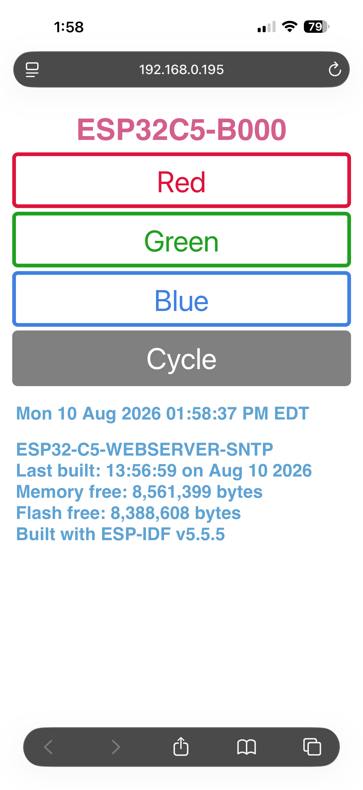
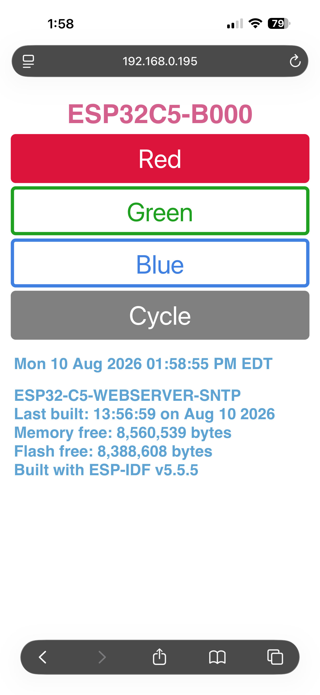

# ESP32-C5-WEBSERVER-SNTP
* Manipulates the NeoPixel LED using the on-board RMT for the on-board addressable LED, i.e [WS2812](http://www.world-semi.com/web/index.php?topclassid=16&classid=302&lanstr=en).
* Connects to a local WiFi access point (AP) and runs an on-chip web server. When fully operational, the IP address is printed to the terminal when `idf.py -p /dev/ttyUSB# monitor` is executed at the command line. 
* Sets the board's internal time via an external SNTP server, via WiFi. The time is printed at the command line and is a part of the built-in webserver page (see example below).

## Hardware Used

* A specific development board with an ESP32-C5-WROOOM-1 SoC, the ESP32-C5-DevKitC-1 V1.2. This board has 8 MB PSRAM and 8 MB FLASH.
* A micro USB cable for power, programming and command line communications.
    - *_Make sure the USB cable supports both data and power._*

The development board used in this application has an addressable LED:

| Board                        | LED type      | Pin      |
| ---------------------------- | ------------- | -------- |
| ESP32-C5-DevKitC-1 V1.2 N8R8 | Addressable   | GPIO27   |

See [ESP32-C5-DevKitC-1 v1.2](https://docs.espressif.com/projects/esp-dev-kits/en/latest/esp32c5/esp32-c5-devkitc-1/user_guide.html)
for more information about it.

## ESP-IDF Toolchain Version

This project uses ESP-IDF version 5.5.5 in order to enable all the flash and memory available on the ESP32-C5-DevKitC-1.

## Configuration

Set the correct chip target using `idf.py set-target esp32c5`.

The ESP32-C5-DevKitC-1 comes with an ESP32-C5-WROOM-1 SOC, 8 MB (N8) of flash and 8 MB (R8) of external RAM. Use `idf.py menuconfig` to configure specific properties of the DevKit board to select how much external RAM and FLASH.

Set the amount of flash from the default of 2 GB to 8 GB. 
1. At the top-level of menuconfig select Serial flasher config; 
    - select Flash size (2 MB);
    - move down to 8 MB and select it, then return to the top of menuconfig.
2. Enable the external RAM.
    - At top-level of menuconfig select Component config; 
    - scroll down and select ESP PSRAM; 
    - enable Support for external, SPI-connected RAM; 
    - move down to and select SPI RAM config;
    - select Mode (QUAD/OCT) of SPI RAM chip in use (Quad Mode PSRAM); 
    - select Octal Mode PSRAM;
    - step back one level (left arrow).
3. Move down to Initialize SPI RAM during startup and enable it;
    - move down to Run memory test on SPI RAM initialization and enable it.
4. Press ‘Q’ key and 'Y' to save these changes.

Once configured, make sure that your local (home or work) access point SSID and password are correct and assigned to the variables EXTERNAL_AP_SSID and EXTERNAL_AP_PWD respectively in `settings.h`. Otherwise the ESP32C5 website won't be available.

The file `settings.h` will need to be created locally, as there is no version in the repo. The file `.gitignore` ignores `settings.h` so that it will never be checked into the repo. Here's a simply template to copy and paste to re-create `settings.h`.
```
#pragma once
#define EXTERNAL_AP_SSID "YOUR_SSID"
#define EXTERNAL_AP_PWD "YOUR_PASSWORD"
```

## Build and Flash

Run `idf.py -p PORT flash monitor` to build, flash and monitor the project.

(To exit the serial monitor, type ``Ctrl-]``.)

See the [Getting Started Guide](https://docs.espressif.com/projects/esp-idf/en/latest/esp32c5/get-started/index.html) for full steps to configure and use ESP-IDF to build projects.

## Example Output

As you run the application, you'll eventually get to the section that tells
you what IP address your local WiFi router assigned to the board.

```
I (23) boot: ESP-IDF v5.5.5 2nd stage bootloader
I (23) boot: compile time Aug 10 2026 09:39:24
I (24) boot: chip revision: v1.0
I (25) boot: efuse block revision: v0.3
I (27) boot.esp32c5: SPI Speed      : 80MHz
I (31) boot.esp32c5: SPI Mode       : DIO
I (35) boot.esp32c5: SPI Flash Size : 8MB
I (38) boot: Enabling RNG early entropy source...
I (43) boot: Partition Table:
I (45) boot: ## Label            Usage          Type ST Offset   Length
I (52) boot:  0 nvs              WiFi data        01 02 00009000 00006000
I (58) boot:  1 phy_init         RF data          01 01 0000f000 00001000
I (65) boot:  2 factory          factory app      00 00 00010000 00100000
I (72) boot: End of partition table
I (75) esp_image: segment 0: paddr=00010020 vaddr=420c0020 size=23480h (144512) map
I (107) esp_image: segment 1: paddr=000334a8 vaddr=40800000 size=0cb70h ( 52080) load
I (119) esp_image: segment 2: paddr=00040020 vaddr=42000020 size=ba180h (762240) map
I (250) esp_image: segment 3: paddr=000fa1a8 vaddr=4080cb70 size=0c0e4h ( 49380) load
I (260) esp_image: segment 4: paddr=00106294 vaddr=40818c80 size=04950h ( 18768) load
I (270) boot: Loaded app from partition at offset 0x10000
I (271) boot: Disabling RNG early entropy source...
I (282) MSPI Timing: Enter flash timing tuning
I (283) esp_psram: Found 8MB PSRAM device
I (283) esp_psram: Speed: 40MHz
I (283) cpu_start: Unicore app
I (2073) esp_psram: SPI SRAM memory test OK
I (2093) cpu_start: GPIO 12 and 11 are used as console UART I/O pins
I (2093) cpu_start: Pro cpu start user code
I (2093) cpu_start: cpu freq: 240000000 Hz
I (2095) app_init: Application information:
I (2099) app_init: Project name:     ESP32C5-WEBSERVER-SNTP
I (2105) app_init: App version:      3bd4065-dirty
I (2109) app_init: Compile time:     Aug 10 2026 21:34:56
I (2114) app_init: ELF file SHA256:  63923c849...
I (2119) app_init: ESP-IDF:          v5.5.5
I (2123) efuse_init: Min chip rev:     v1.0
I (2126) efuse_init: Max chip rev:     v1.99 
I (2131) efuse_init: Chip rev:         v1.0
I (2135) heap_init: Initializing. RAM available for dynamic allocation:
I (2141) heap_init: At 408239A0 len 00038C00 (227 KiB): RAM
I (2146) heap_init: At 4085C5A0 len 00002F58 (11 KiB): RAM
I (2151) heap_init: At 50000000 len 00003FE8 (15 KiB): RTCRAM
W (2157) esp_psram: Due to hardware issue on ESP32-C5/C61 (Rev v1.0), PSRAM contents won't be encrypted (for flash encryption enabled case)
W (2169) esp_psram: Please avoid using PSRAM for security sensitive data e.g., TLS stack allocations (CONFIG_MBEDTLS_EXTERNAL_MEM_ALLOC)
I (2181) esp_psram: Adding pool of 8192K of PSRAM memory to heap allocator
I (2188) spi_flash: detected chip: generic
I (2191) spi_flash: flash io: dio
W (2194) spi_flash: CPU frequency is set to 240MHz. esp_flash_write_encrypted() will automatically limit CPU frequency to 80MHz during execution.
I (2208) sleep_gpio: Configure to isolate all GPIO pins in sleep state
I (2214) sleep_gpio: Enable automatic switching of GPIO sleep configuration
I (2220) coexist: coex firmware version: 6f3d08c
I (2225) coexist: coexist rom version 78e5c6e42
I (2229) main_task: Started on CPU0
I (2229) esp_psram: Reserving pool of 32K of internal memory for DMA/internal allocations
I (2239) main_task: Calling app_main()
I (2239) ESP32-C5-WEBSERVER-SNTP: APP_MAIN BEGIN
I (2239) ESP32-C5-WEBSERVER-SNTP: CHIP_INFORMATION
I (2249) ESP32-C5-WEBSERVER-SNTP: ESP-IDF VERSION: v5.5.5
I (2249) ESP32-C5-WEBSERVER-SNTP: CHIP MODEL: ESP32C5
I (2259) ESP32-C5-WEBSERVER-SNTP: CHIP FEATURES: WIFI BLE IEEE802154 
I (2259) ESP32-C5-WEBSERVER-SNTP: REVISION: 64
I (2269) ESP32-C5-WEBSERVER-SNTP: FREE HEAP: 8,631,383 BYTES
I (2269) ESP32-C5-WEBSERVER-SNTP: FLASH SIZE: 8,388,608 EXTERNAL BYTES
I (2279) ESP32-C5-WEBSERVER-SNTP: MAC ADDR: D0CF13EDB000
I (2289) ESP32-C5-WEBSERVER-SNTP: SSID: ESP32C5-B000
I (2289) ESP32-C5-WEBSERVER-SNTP: APP_MAIN INITIALIZE NEOPIXEL
I (2299) ESP32-C5-WEBSERVER-SNTP: APP_MAIN CYCLE NEOPIXEL
I (5799) ESP32-C5-WEBSERVER-SNTP: APP_MAIN INITIALISE NVS FLASH
I (5809) ESP32-C5-WEBSERVER-SNTP: APP_MAIN INITIALIZE WIFI
I (5809) ESP32-C5-WEBSERVER-SNTP: INITIALIZE_WIFI_STATION
I (5809) ESP32-C5-WEBSERVER-SNTP: WIFI CREATE EVENT GROUP
I (5809) ESP32-C5-WEBSERVER-SNTP: WIFI INITIALISE NETIF
I (5819) ESP32-C5-WEBSERVER-SNTP: WIFI CREATE DEFAULT EVENT LOOP
I (5819) ESP32-C5-WEBSERVER-SNTP: WIFI SET HOST NAME TO ESP32C5-B000: SUCCESS
I (5829) ESP32-C5-WEBSERVER-SNTP: WIFI CREATE DEFAULT WIFI STATION
I (5839) pp: pp rom version: 78a72e9d5
I (5839) net80211: net80211 rom version: 78a72e9d5
I (5849) wifi:wifi driver task: 40831cd0, prio:23, stack:6656, core=0
I (5859) wifi:wifi firmware version: b9f67df
I (5859) wifi:wifi certification version: v7.0
I (5859) wifi:config NVS flash: enabled
I (5859) wifi:config nano formatting: disabled
I (5859) wifi:mac_version:HAL_MAC_ESP32AX_752MP_ECO2,ut_version:N, band mode:0x3
I (5869) wifi:Init data frame dynamic rx buffer num: 32
I (5879) wifi:Init static rx mgmt buffer num: 5
I (5879) wifi:Init management short buffer num: 32
I (5889) wifi:Init dynamic tx buffer num: 32
I (5889) wifi:Init static tx FG buffer num: 2
I (5889) wifi:Init static rx buffer size: 1700 (rxctrl:64, csi:512)
I (5899) wifi:Init static rx buffer num: 10
I (5899) wifi:Init dynamic rx buffer num: 32
I (5909) wifi_init: rx ba win: 6
I (5909) wifi_init: accept mbox: 6
I (5909) wifi_init: tcpip mbox: 32
I (5919) wifi_init: udp mbox: 6
I (5919) wifi_init: tcp mbox: 6
I (5919) wifi_init: tcp tx win: 5760
I (5929) wifi_init: tcp rx win: 5760
I (5929) wifi_init: tcp mss: 1440
I (5929) wifi_init: WiFi IRAM OP enabled
I (5939) wifi_init: WiFi RX IRAM OP enabled
I (5939) wifi_init: WiFi SLP IRAM OP enabled
I (5939) ESP32-C5-WEBSERVER-SNTP: WIFI REGISTER ESP EVENT ANY ID
I (5949) ESP32-C5-WEBSERVER-SNTP: WIFI REGISTER IP EVENT STA GOT IP
I (5959) ESP32-C5-WEBSERVER-SNTP: WIFI USING AP SSID: g00gleeeyes
I (5959) ESP32-C5-WEBSERVER-SNTP: WIFI USING AP PSWD: 51538688
I (5969) phy_init: phy_version 109,edb400d6,Mar 10 2026,10:22:11
I (6569) wifi:11ax coex: WDEVAX_PTI0(0x55777555), WDEVAX_PTI1(0x00003377).

I (6569) wifi:mode : sta (d0:cf:13:ed:b0:00)
I (6569) wifi:enable tsf
I (6569) ESP32-C5-WEBSERVER-SNTP: WIFI_EVENT_HOME_CHANNEL_CHANGE
I (6579) ESP32-C5-WEBSERVER-SNTP: WIFI_EVENT_STA_START
W (6669) wifi:(cap)capinfo:0x1111, Spectrum Management:1 
W (6669) wifi:(vht)vhtcap:0xf8b69b1, sgi_rx(80mhz:1, 160/80+80mhz:0), stbc(tx:1, rx:1), ldpc_rx:1, bfmer(su:1, mu:1, nsts:3)
W (6669) wifi:(vht)max.RxMPDULen:1(7991), max.RxAMPDULenExponent:7, max.RxAMPDUpre-EOFpaddingBytes:1048575(0xfffff)
W (6679) wifi:(vht)rx(mcs:0xffaa, highest:0x0, highest_lgi_rate:0), tx(mcs:0xffaa, highest:0x0, highest_lgi_rate:0), max_rate:144
W (6689) wifi:(vht)bandwidth:1, chan_center_frq_seg0:155, chan_center_frq_seg1:0
W (6699) wifi:(ht)primary_chann:157, ht2ndchan:1
W (6699) wifi:(vht)BSS bandwidth:80MHz
I (6709) wifi:(he)max.RxAMPDULenExponentExtension:2, max.RxAMPDUpre-EOFpaddingBytes:4194303(0x3fffff)
I (6719) wifi:(mac)omc_ul_mu_data_disable_rx:1
I (6719) wifi:(phy)ppe_thresholds_present:1, nominal_packet_padding:0
I (6729) wifi:(phy)dcm tx(constellation:0, nss:0), dcm rx(constellation:0, nss:0)
I (6729) wifi:(phy)rx_mcs_map:0xffaa, tx_mcs_map:0xffaa, stbc_tx:0, bfmer(su:1, mu:0), ldpc:1, max_rate:172
I (6739) wifi:(phy)nsts:4, ru_index_bitmap:0x7(242:1, 484:1, 996:1, 2*996:0)
I (6749) wifi:(phy)threshold_bits:72, nsts_num:4, ru_num:3, he_cap->len:32, ppe_threshold_len:10(6,11,4)
I (6759) wifi:(ppe)RU242, NSTS0, PPE16:0, PPE8:7, nominal_packet_padding:2
I (6769) wifi:(opr)len:7, TWT Required:0, VHT Opr Info Present:0, 6GHz Opr Info Present:0, Co-Hosted BSS:0(max_indicator:0), Basic MCS and NSS:0xfffc
I (6779) wifi:(opr)len:7, Default PE Duration:4, TXOP RTS Threshold:0(0 us), ER-SU-Disable:0
I (6789) wifi:(opr)len:7, BSS Color:37, disabled:0, Partial BSS Color:0
W (6789) wifi:(regdomain)len:12, country:US, env:all, ngroup:3
I (6799) wifi:new:<157,0>, old:<1,0>, ap:<255,255>, sta:<157,0>, prof:1, snd_ch_cfg:0x12
I (6809) wifi:(connect)dot11_authmode:0x3, pairwise_cipher:0x3, group_cipher:0x1
I (6809) wifi:state: init -> auth (0xb0)
I (6819) ESP32-C5-WEBSERVER-SNTP: WIFI_EVENT_HOME_CHANNEL_CHANGE
I (6819) wifi:state: auth -> assoc (0x0)
I (6829) wifi:(assoc)RESP, Extended Capabilities length:8, operating_mode_notification:1
I (6829) wifi:(assoc)RESP, Extended Capabilities, MBSSID:0, TWT Responder:0, OBSS Narrow Bandwidth RU In OFDMA Tolerance:0
I (6849) wifi:(he)max.RxAMPDULenExponentExtension:2, max.RxAMPDUpre-EOFpaddingBytes:4194303(0x3fffff)
I (6849) wifi:(mac)omc_ul_mu_data_disable_rx:1
I (6859) wifi:(phy)ppe_thresholds_present:1, nominal_packet_padding:0
I (6859) wifi:(phy)dcm tx(constellation:0, nss:0), dcm rx(constellation:0, nss:0)
I (6869) wifi:(phy)rx_mcs_map:0xffaa, tx_mcs_map:0xffaa, stbc_tx:0, bfmer(su:1, mu:0), ldpc:1, max_rate:172
I (6879) wifi:(phy)nsts:4, ru_index_bitmap:0x7(242:1, 484:1, 996:1, 2*996:0)
I (6889) wifi:(phy)threshold_bits:72, nsts_num:4, ru_num:3, he_cap->len:32, ppe_threshold_len:10(6,11,4)
I (6899) wifi:(ppe)RU242, NSTS0, PPE16:0, PPE8:7, nominal_packet_padding:2
I (6899) wifi:(opr)len:7, TWT Required:0, VHT Opr Info Present:0, 6GHz Opr Info Present:0, Co-Hosted BSS:0(max_indicator:0), Basic MCS and NSS:0xfffc
I (6919) wifi:(opr)len:7, Default PE Duration:4, TXOP RTS Threshold:0(0 us), ER-SU-Disable:0
I (6929) wifi:(opr)len:7, BSS Color:37, disabled:0, Partial BSS Color:0
I (6929) wifi:state: assoc -> run (0x10)
I (6939) wifi:(he)ppe_thresholds_present:1, nominal_packet_padding(rx:0, cfg:2)
I (6939) wifi:(trc)phytype:CBW20-SGI, snr:43, maxRate:172, highestRateIdx:0
W (6949) wifi:(trc)band:5G, phymode:3, highestRateIdx:0, lowestRateIdx:9, dataSchedTableSize:10
I (6959) wifi:(trc)band:5G, rate(S-MCS7, rateIdx:0), ampdu(rate:S-MCS7, schedIdx(0, stop:8)), snr:43, ampduState:wait operational
I (6969) wifi:ifidx:0, rssi:-53, nf:-96, phytype(0x3, CBW20-SGI), phymode(0x7, 11ax), max_rate:172, he:1, vht:1, ht:1
I (6979) wifi:(ht)max.RxAMPDULenExponent:3(65535 bytes), MMSS:5(4 us)
W (6989) wifi:<ba-add>idx:0, ifx:0, tid:5, TAHI:0x100ec71, TALO:0xfbc306c0, (ssn:0, win:64, cur_ssn:0), CONF:0xc0005001
I (6999) wifi:(extcap)mbssid:0, enhanced_mbssid_advertise:0, complete_nontxbssid_profiles:0, twt_responder: 0
I (7009) wifi:connected with g00gleeeyes, aid = 9, channel 157, BW20(ABOVE, C2), bssid = c0:06:c3:fb:71:ec
I (7009) wifi:security: WPA2-PSK, phy: ax, rssi: -53, cipher(pairwise:0x3, group:0x1), pmf:0
I (7019) wifi:pm start, type: 1, twt_start:0

I (7029) wifi:pm start, type:1, aid:0x9, trans-BSSID:c0:06:c3:fb:71:ec, BSSID[5]:0xec, mbssid(max-indicator:0, index:0), he:1
I (7039) wifi:set rx beacon pti, rx_bcn_pti: 10, bcn_timeout: 25000, mt_pti: 10, mt_time: 10000
I (7049) wifi:[ADDBA]TX addba request, tid:0, dialogtoken:1, bufsize:32, A-MSDU:0(not supported), policy:1(IMR), ssn:0(0x0)
I (7059) wifi:[ADDBA]TX addba request, tid:7, dialogtoken:2, bufsize:32, A-MSDU:0(not supported), policy:1(IMR), ssn:0(0x20)
I (7069) wifi:[ADDBA]TX addba request, tid:5, dialogtoken:3, bufsize:32, A-MSDU:0(not supported), policy:1(IMR), ssn:0(0x0)
I (7079) wifi:AP's beacon interval = 102400 us, DTIM period = 1
I (7089) wifi:[ADDBA]RX addba response, status:0, tid:7/tb:1(0xa1), bufsize:32, batimeout:0, txa_wnd:32
I (7089) wifi:[ADDBA]RX addba response, status:0, tid:0/tb:1(0xa1), bufsize:32, batimeout:0, txa_wnd:32
I (7099) wifi:[ADDBA]RX addba response, status:0, tid:5/tb:1(0xa1), bufsize:32, batimeout:0, txa_wnd:32
I (7109) ESP32-C5-WEBSERVER-SNTP: WIFI_EVENT_STA_CONNECTED
W (7119) wifi:<ba-add>idx:1, ifx:0, tid:6, TAHI:0x100ec71, TALO:0xfbc306c0, (ssn:0, win:64, cur_ssn:0), CONF:0xc0006001
I (8149) esp_netif_handlers: sta ip: 192.168.0.195, mask: 255.255.255.0, gw: 192.168.0.1
I (8149) ESP32-C5-WEBSERVER-SNTP: IP_EVENT_STA_GOT_IP: 192.168.0.195
I (8149) ESP32-C5-WEBSERVER-SNTP: WIFI INITIALIZE: CONNECTION SUCCESS
I (8149) ESP32-C5-WEBSERVER-SNTP: INITIALIZE_SNTP
W (10809) wifi:<ba-add>idx:2, ifx:0, tid:0, TAHI:0x100ec71, TALO:0xfbc306c0, (ssn:0, win:64, cur_ssn:0), CONF:0xc0000001
I (10969) ESP32-C5-WEBSERVER-SNTP: WIFI SUCCESSFUL INITIALIZATION
I (10969) ESP32-C5-WEBSERVER-SNTP: APP_MAIN INITIALIZE WEBSERVER
I (10969) ESP32-C5-WEBSERVER-SNTP: INITIALIZE_WEBSERVER
I (10979) ESP32-C5-WEBSERVER-SNTP: WEBSERVER SUCCESSFUL STARTUP
I (10979) ESP32-C5-WEBSERVER-SNTP: APP_MAIN ENTERING MAIN LOOP
...
```
In my case it was the line `esp_netif_handlers: sta ip: 192.168.0.195, mask: 255.255.255.0, gw: 192.168.0.1`.
## Output Key Points
* Note that the SSID/host name is unique for each Espressif board and is based on the Espressif board on which you are running the code.

## Mobile Screenshot
This is what a typical smartphone screen would show if accessing the built-in webserver after the application starts. In this example, this is an iPhone 16 Pro Max and using the Safari mobile browser.

The top of each screen will show an autogenerated SSID, built from the device ID and the last four hexadecimal digits of the devices unique ID.

The IP address at the top of each screen is the address assigned by the local access point's DHCP service. This is not fixed within the software.

<br />
Pressing any button will perform that action on the Espressif board. For example `Red` turns the NeoPixel on as red, `Blue` turns the NeoPixel on as blue, etc. The 'Cycle' button cycles the NeoPixel through six distinct colors, then off. The page uses a POST action to perform the action. The page always returns to this view, with the button pressed filled in and the date at the bottom updated.

<br />
For example, this is what the webpage shows after pressing `Red`. The NeoPixel will now be red. If you press `Red` again, then the NeoPixel is turned off and the `Red` button goes to its original outline. Pressing any of the other color buttons will set the NeoPixel to that color. You don't have to press a given color button twice to turn it off.

### Mobile Screenshot Values
+ At the very top is the devices SSID. In this example, it's ESP32C5-B000. This is dynamically created from information that is integral to the board itself. It will be different on any ESP32 board this software is compiled and run on.
+ Directly beneath the `Cycle` button is the time and date that was originally synced from an external SNTP server. If the application fails to reach an SNTP server, then time starts from 1 January 1970.
+ Next, is the name of the project. This is the same as the TAG string that is defined in `common.h` and is displayed while monitoring the USB output.
+ Next is the last built date, the date the application was compiled. This is not the same date it was uploaded to the part.
+ Next is the amount of PSRAM memory free in bytes.
+ Next is the amount of FLASH memory free in bytes.
+ The last line is the version of ESP-IDF used to build the application.

# Troubleshooting
* Make sure that your local (home or work) access point SSID and password are correctly #defined by the definitions EXTERNAL_AP_SSID and EXTERNAL_AP_PWD respectively inside `settings.h`. 

Again, please note that this header file is not checked in as it contains sensitive information. You'll need to create your own version of this file with the two definitions. The default .gitignore file ignores checking in any file by this name.

    Copyright 2026 William H. Beebe, Jr.

    Licensed under the Apache License, Version 2.0 (the "License");
    you may not use this file except in compliance with the License.
    You may obtain a copy of the License at

    http://www.apache.org/licenses/LICENSE-2.0

    Unless required by applicable law or agreed to in writing, software
    distributed under the License is distributed on an "AS IS" BASIS,
    WITHOUT WARRANTIES OR CONDITIONS OF ANY KIND, either express or implied.
    See the License for the specific language governing permissions and
    limitations under the License.
