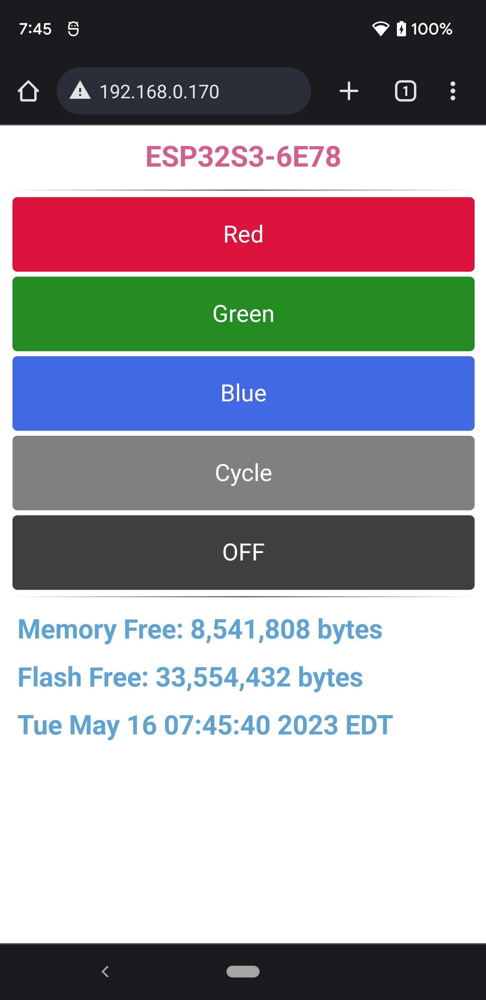
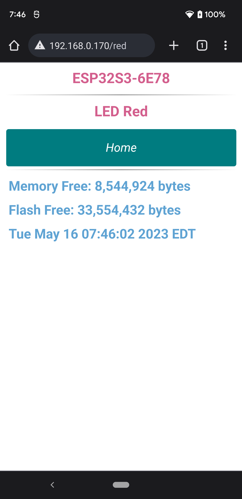

# ESP32-S3-DevKitC-1-N32R8
* Manipulates the Color LED using the on-board RMT for the on-board addressable LED, i.e [WS2812](http://www.world-semi.com/Certifications/WS2812B.html).
* Connects to a local WiFi access point (AP) and runs an on-chip web server. When fully operational, the IP address is printed to the terminal when `idf.py monitor` is executed at the command line. 
* Connect to and get time via SNTP. The time is printed at the command line and is a part of the built-in webserver page.

## Hardware Used

* A specific development board with an ESP32-S3-WROOOM-2 SoC, the ESP32-S3-DevKitC-1-N32R32. This board has 8 MB PSRAM and 32 MB FLASH.
* A micro USB cable for power, programming and command line communications.
    - **Make sure the USB cable supports both data and power.**

The development board used in this application has an addressable LED:

| Board                    | LED type      | Pin      |
| ------------------------ | ------------- | -------- |
| ESP32-S3-DevKitC-1-N8R32 | Addressable   | GPIO38   |

See [Development Boards](https://www.espressif.com/en/products/devkits)
for more information about it.

## ESP-IDF Toolchain Version

This project uses ESP-IDF main in order to enable all the flash and memory available on the ESP32-S3-DevKitC-1-N8R32. This is currently identifying itself as version v5.2-dev.

## Configuration

Set the correct chip target using `idf.py set-target esp32s3`.

The ESP32-S3-DevKitC-1-N32R32 comes with an ESP32-S3-WROOM-2 SOC, 32 MB (N32) of flash and 8 MB (R8) of external RAM. Use `idf.py menuconfig` to configure specific properties of the DevKit board to select how much external RAM and FLASH.

Set the amount of flash from the default of 2 GB to 32 GB. 
1. At the top-level of menuconfig select Serial flasher config; 
    - select Flash size (2 MB);
    - move down to 32 MB and select it, then return to the top of menuconfig.
2. Enable the external RAM.
    - At top-level of menuconfig select Component config; 
    - scroll down and select ESP PSRAM; 
    - enable Support for external, SPI-connected RAM; 
    - move down to and select SPI RAM config;
    - select Mode (QUAD/OCT) of SPI RAM chip in use (Quad Mode PSRAM); 
    - select Octal Mode PSRAM;
    - step back one level (left arrow).
3. Move down to Initialize SPI RAM during startup and enable it;
    - move down to Run memory test on SPI RAM initialization and enable it.
4. Press ‘Q’ key and 'Y' to save these changes.

**_Once configured, make sure that your local (home or work) access point SSID and password are correct and plugged into the variables EXTERNAL_AP_SSID and EXTERNAL_AP_PWD respectively at the top of wifi_tools.cpp. Otherwise the ESP32S3 website won't be available._**

## Build and Flash

Run `idf.py -p PORT flash monitor` to build, flash and monitor the project.

(To exit the serial monitor, type ``Ctrl-]``.)

See the [Getting Started Guide](https://docs.espressif.com/projects/esp-idf/en/latest/get-started/index.html) for full steps to configure and use ESP-IDF to build projects.

## Example Output

As you run the application you'll see the LED blinking.

```
Hard resetting via RTS pin...
Executing action: monitor
Running idf_monitor in directory /home/mint/Develop/EspressifProjects/v5/esp32-s3-n32r8
Executing "/home/mint/.espressif/python_env/idf5.2_py3.10_env/bin/python /home/mint/Develop/esp/esp-idf-main/tools/idf_monitor.py -p /dev/ttyUSB0 -b 115200 --toolchain-prefix xtensa-esp32s3-elf- --target esp32s3 /home/mint/Develop/EspressifProjects/v5/esp32-s3-n32r8/build/esp32-s3-r8n32.elf -m '/home/mint/.espressif/python_env/idf5.2_py3.10_env/bin/python' '/home/mint/Develop/esp/esp-idf-main/tools/idf.py' '-p' '/dev/ttyUSB0'"...
--- idf_monitor on /dev/ttyUSB0 115200 ---
--- Quit: Ctrl+] | Menu: Ctrl+T | Help: Ctrl+T followed by Ctrl+H ---
ESP-ROM:esp32s3-20210327
Build:Mar 27 2021
rst:0x1 (POWERON),boot:0x18 (SPI_FAST_FLASH_BOOT)
SPIWP:0xee
Octal Flash Mode Enabled
For OPI Flash, Use Default Flash Boot Mode
mode:SLOW_RD, clock div:1
load:0x3fce3818,len:0x16f4
load:0x403c9700,len:0x4
load:0x403c9704,len:0xbfc
load:0x403cc700,len:0x2efc
entry 0x403c9904
I (33) boot: ESP-IDF v5.2-dev-503-g17451f1fb3 2nd stage bootloader
I (33) boot: compile time May 15 2023 07:23:33
I (34) boot: Multicore bootloader
I (38) boot: chip revision: v0.1
I (42) boot.esp32s3: Boot SPI Speed : 80MHz
I (47) boot.esp32s3: SPI Mode       : SLOW READ
I (52) boot.esp32s3: SPI Flash Size : 32MB
I (57) boot: Enabling RNG early entropy source...
I (62) boot: Partition Table:
I (66) boot: ## Label            Usage          Type ST Offset   Length
I (73) boot:  0 nvs              WiFi data        01 02 00009000 00006000
I (80) boot:  1 phy_init         RF data          01 01 0000f000 00001000
I (88) boot:  2 factory          factory app      00 00 00010000 00100000
I (95) boot: End of partition table
I (100) esp_image: segment 0: paddr=00010020 vaddr=3c0a0020 size=28344h (164676) map
I (147) esp_image: segment 1: paddr=0003836c vaddr=3fc98200 size=04878h ( 18552) load
I (153) esp_image: segment 2: paddr=0003cbec vaddr=40374000 size=0342ch ( 13356) load
I (157) esp_image: segment 3: paddr=00040020 vaddr=42000020 size=90ee8h (593640) map
I (302) esp_image: segment 4: paddr=000d0f10 vaddr=4037742c size=10d2ch ( 68908) load
I (330) boot: Loaded app from partition at offset 0x10000
I (331) boot: Disabling RNG early entropy source...
I (342) cpu_start: Multicore app
I (342) octal_psram: vendor id    : 0x0d (AP)
I (343) octal_psram: dev id       : 0x02 (generation 3)
I (346) octal_psram: density      : 0x03 (64 Mbit)
I (351) octal_psram: good-die     : 0x01 (Pass)
I (356) octal_psram: Latency      : 0x01 (Fixed)
I (362) octal_psram: VCC          : 0x00 (1.8V)
I (367) octal_psram: SRF          : 0x01 (Fast Refresh)
I (373) octal_psram: BurstType    : 0x01 (Hybrid Wrap)
I (379) octal_psram: BurstLen     : 0x01 (32 Byte)
I (384) octal_psram: Readlatency  : 0x02 (10 cycles@Fixed)
I (390) octal_psram: DriveStrength: 0x00 (1/1)
I (395) esp_psram: Found 8MB PSRAM device
I (400) esp_psram: Speed: 40MHz
I (404) cpu_start: Pro cpu up.
I (408) cpu_start: Starting app cpu, entry point is 0x403754dc
0x403754dc: call_start_cpu1 at /home/mint/Develop/esp/esp-idf-main/components/esp_system/port/cpu_start.c:154

I (0) cpu_start: App cpu up.
I (1145) esp_psram: SPI SRAM memory test OK
I (1154) cpu_start: Pro cpu start user code
I (1154) cpu_start: cpu freq: 240000000 Hz
I (1154) cpu_start: Application information:
I (1157) cpu_start: Project name:     esp32-s3-r8n32
I (1163) cpu_start: App version:      df1424f-dirty
I (1169) cpu_start: Compile time:     May 15 2023 07:23:25
I (1175) cpu_start: ELF file SHA256:  dbfaac464c3cf77c...
I (1181) cpu_start: ESP-IDF:          v5.2-dev-503-g17451f1fb3
I (1187) cpu_start: Min chip rev:     v0.0
I (1192) cpu_start: Max chip rev:     v0.99 
I (1197) cpu_start: Chip rev:         v0.1
I (1202) heap_init: Initializing. RAM available for dynamic allocation:
I (1209) heap_init: At 3FCA0A40 len 00048CD0 (291 KiB): DRAM
I (1216) heap_init: At 3FCE9710 len 00005724 (21 KiB): STACK/DRAM
I (1222) heap_init: At 3FCF0000 len 00008000 (32 KiB): DRAM
I (1229) heap_init: At 600FE010 len 00001FF0 (7 KiB): RTCRAM
I (1235) esp_psram: Adding pool of 8192K of PSRAM memory to heap allocator
I (1243) spi_flash: detected chip: mxic (opi)
I (1247) spi_flash: flash io: opi_str
I (1252) sleep: Configure to isolate all GPIO pins in sleep state
I (1259) sleep: Enable automatic switching of GPIO sleep configuration
I (1266) app_start: Starting scheduler on CPU0
I (1271) app_start: Starting scheduler on CPU1
I (1271) main_task: Started on CPU0
I (1281) esp_psram: Reserving pool of 32K of internal memory for DMA/internal allocations
I (1291) main_task: Calling app_main()
I (1291) ESP32-S3-DevKitC-1.1-N32R8: APP_MAIN BEGIN
I (1301) ESP32-S3-DevKitC-1.1-N32R8: ESP-IDF VERSION: v5.2-dev-503-g17451f1fb3
I (1311) ESP32-S3-DevKitC-1.1-N32R8: CHIP MODEL: ESP32S3
I (1311) ESP32-S3-DevKitC-1.1-N32R8: CHIP FEATURES: WIFI BLE 
I (1321) ESP32-S3-DevKitC-1.1-N32R8: REVISION: 1
I (1321) ESP32-S3-DevKitC-1.1-N32R8: FREE HEAP: 8,692,728 BYTES
I (1331) ESP32-S3-DevKitC-1.1-N32R8: FLASH SIZE: 33,554,432 EXTERNAL BYTES
I (1341) ESP32-S3-DevKitC-1.1-N32R8: MAC ADDR: F412FAE86E78
I (1341) ESP32-S3-DevKitC-1.1-N32R8: SSID: ESP32S3-6E78
I (1351) ESP32-S3-DevKitC-1.1-N32R8: INITIALIZE NEOPIXEL
I (1361) gpio: GPIO[38]| InputEn: 0| OutputEn: 1| OpenDrain: 0| Pullup: 1| Pulldown: 0| Intr:0 
I (1371) ESP32-S3-DevKitC-1.1-N32R8: INITIALIZE WIFI
I (1371) ESP32-S3-DevKitC-1.1-N32R8: INITIALISE NVS FLASH
I (1401) ESP32-S3-DevKitC-1.1-N32R8: INITIALISE ESP NETIF
I (1401) ESP32-S3-DevKitC-1.1-N32R8: CREATE DEFAULT EVENT LOOP
I (1401) ESP32-S3-DevKitC-1.1-N32R8: CREATE DEFAULT WIFI STATION
I (1411) pp: pp rom version: e7ae62f
I (1411) net80211: net80211 rom version: e7ae62f
I (1421) wifi:wifi driver task: 3fcb4218, prio:23, stack:6656, core=0
I (1431) wifi:wifi firmware version: c08166b
I (1431) wifi:wifi certification version: v7.0
I (1431) wifi:config NVS flash: enabled
I (1431) wifi:config nano formating: disabled
I (1441) wifi:Init data frame dynamic rx buffer num: 32
I (1441) wifi:Init management frame dynamic rx buffer num: 32
I (1451) wifi:Init management short buffer num: 32
I (1451) wifi:Init static tx buffer num: 16
I (1461) wifi:Init tx cache buffer num: 32
I (1461) wifi:Init static tx FG buffer num: 2
I (1461) wifi:Init static rx buffer size: 1600
I (1471) wifi:Init static rx buffer num: 10
I (1471) wifi:Init dynamic rx buffer num: 32
I (1481) wifi_init: rx ba win: 6
I (1481) wifi_init: tcpip mbox: 32
I (1481) wifi_init: udp mbox: 6
I (1491) wifi_init: tcp mbox: 6
I (1491) wifi_init: tcp tx win: 5744
I (1501) wifi_init: tcp rx win: 5744
I (1501) wifi_init: tcp mss: 1440
I (1511) wifi_init: WiFi IRAM OP enabled
I (1511) wifi_init: WiFi RX IRAM OP enabled
I (1511) ESP32-S3-DevKitC-1.1-N32R8: REGISTER ESP EVENT ANY ID
I (1521) ESP32-S3-DevKitC-1.1-N32R8: REGISTER IP EVENT STA GOT IP
I (1541) phy_init: phy_version 600,8dd0147,Mar 31 2023,16:34:12
I (1581) wifi:mode : sta (f4:12:fa:e8:6e:78)
I (1581) wifi:enable tsf
I (1581) ESP32-S3-DevKitC-1.1-N32R8: WIFI_EVENT_STA_START
I (1581) ESP32-S3-DevKitC-1.1-N32R8: SET HOST NAME: SUCCESS
I (3981) wifi:new:<9,0>, old:<1,0>, ap:<255,255>, sta:<9,0>, prof:6
I (4791) wifi:state: init -> auth (b0)
I (4791) wifi:state: auth -> assoc (0)
I (4801) wifi:state: assoc -> run (10)
I (4811) wifi:<ba-add>idx:0 (ifx:0, c0:06:c3:fb:71:ed), tid:5, ssn:0, winSize:64
I (4811) wifi:connected with g00gleeeyes, aid = 1, channel 9, BW20, bssid = c0:06:c3:fb:71:ed
I (4811) wifi:security: WPA2-PSK, phy: bgn, rssi: -56
I (4831) wifi:pm start, type: 1

I (4831) wifi:set rx beacon pti, rx_bcn_pti: 0, bcn_timeout: 25000, mt_pti: 0, mt_time: 10000
I (4831) ESP32-S3-DevKitC-1.1-N32R8: WIFI_EVENT_STA_CONNECTED
I (4831) wifi:<ba-add>idx:1 (ifx:0, c0:06:c3:fb:71:ed), tid:6, ssn:0, winSize:64
I (4901) wifi:AP's beacon interval = 102400 us, DTIM period = 1
I (5831) esp_netif_handlers: sta ip: 192.168.0.170, mask: 255.255.255.0, gw: 192.168.0.1
I (5831) ESP32-S3-DevKitC-1.1-N32R8: IP_EVENT_STA_GOT_IP: 192.168.0.170
I (5831) ESP32-S3-DevKitC-1.1-N32R8: INITIALIZE WIFI: CONNECTION SUCCESS
I (5841) ESP32-S3-DevKitC-1.1-N32R8: WAIT FOR SNTP 1
I (10841) ESP32-S3-DevKitC-1.1-N32R8: TIME: Tue May 16 06:36:19 2023 EDT
I (10841) ESP32-S3-DevKitC-1.1-N32R8: INITIALIZE WIFI DONE
I (10841) ESP32-S3-DevKitC-1.1-N32R8: INITIALIZE WEBSERVER
I (10851) ESP32-S3-DevKitC-1.1-N32R8: STARTING WEB SERVER SUCCESSFUL
I (10851) ESP32-S3-DevKitC-1.1-N32R8: ENTERING APP_MAIN LOOP
```
## Output Key Points
* Look for `IP_EVENT_STA_GOT_IP: 192.168.0.170` to know what IP address to plug into your browser, or else look for the SSID line like `SSID: ESP32S3-6E78` for the SSID/host name. Note that the SSID/host name is unique for each Espressif board and is based on the Espressif board on which you are running the code.

## Screenshots from Handsets
This is what a typical smartphone screen would show if accessing the built-in webserver after the application starts. In this example, this is a Pixel 3 XL running Android 12 and using the default Chrome browser.

The top of each screen will show an autogenerated SSID, built from the device ID and the last two hexadecimal digits of the devices unique ID.

The IP address at the top of each screen is the address assigned by the local access point's DHCP service. This is not fixed within the software.



Pressing any button will perform that act on the Espressif board. Each button's action should be self-explainatory. That is, 'Red' turns the NeoPixel on as red, 'Blue; turns the NeoPixel on as blue, etc. The 'Cycle' button cycles the NeoPixel through six distinct colors, then off.



After each button is pressed, this page is displayed with a 'Home' button which when pressed returns to the top screen. This screen also shows what button/action you pressed to get here.

Note that the bottom of all screens shows how much free memory, how much flash total, and the time of the device. If the Espressif chip successfully sets its internal time via SNTP, then the time will show EDT. Otherwise it shows a time starting from 1 January 1970.

## Troubleshooting

* Make sure that your local (home or work) access point SSID and password are correct and plugged into the variables EXTERNAL_AP_SSID and EXTERNAL_AP_PWD respectively at the top of wifi_tools.cpp. Otherwise the ESP32S3 website won't be available.
